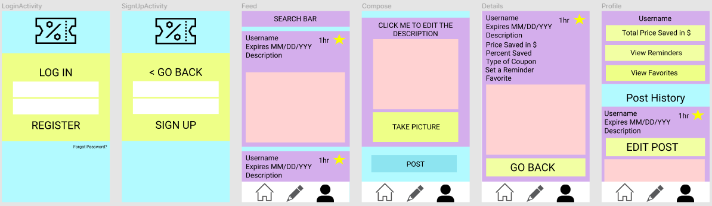
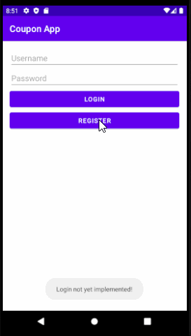

Original App Design Project - Unit 8 README 
===

# Coupon Tracker

## Table of Contents
1. [Overview](#Overview)
1. [Product Spec](#Product-Spec)
1. [Wireframes](#Wireframes)
2. [Schema](#Schema)

## Overview
### Description
Ever wanted to purchase something for cheaper but couldn't find any deals? You might find a discount for some item that someone else wants, or vice versa. If everyone shared their coupons that they find in public, maybe you can get your hands on a bargain! With this app, you can find a coupon of your liking without the hassle of searching on your own. It is community driven, so you can help others help you.
    
### App Evaluation
- **Category:** Market
- **Mobile:** Android
- **Story:** Community-driven app that allows users to share and view coupons.
- **Market:** For users to want a discount on a certain product, or want to share any coupons they find in the public or web.
- **Habit:** Users can post throughout the day and select any coupons of their liking. They can also browse through categories and search any discounts from their local neighborhood.
- **Scope:** Rated E for Everyone

## Product Spec

### 1. User Stories (Required and Optional)

**Required Must-have Stories**

- [X] User must register
- [X] User must login
- [] User can view coupons
   - [] User can view details of coupons
- [X] User can post coupons 
- [] User can delete their own coupons

**Optional Nice-to-have Stories**

- [] User can sort coupons
- [] User can favorite coupons
- [] User can report expired coupons
- [] User can see where the coupon is from
- [] Delete outdated coupons automatically

### 2. Screen Archetypes

* Register
    * User must register
* Login
    * User must login
* Coupon Stream
    * User can view coupons
    * User can sort coupons
    * Delete outdated coupons automatically
* Details
    * User can see type of coupon and what it's for
    * User can see coupon price/percent discount
    * User can inspect expiration date
* Compose/Post Coupons
    * User can post coupons
* Favorites
    * User can favorite coupons
    * User can set reminder to use coupon (notification)
* Maps
    * User can specify where the coupon is from
* Settings (EXTRA)
    * User can set stream settings, like preferences for types of coupons
    * User can set notification settings

### 3. Navigation

**Tab Navigation** (Tab to Screen)

* Coupon Stream (can split to API and Local)
* Favorites
* Maps
* Settings

**Flow Navigation** (Screen to Screen)

* Register
    * Login
* Login
    * Register
    * Coupon Stream
* Coupon Stream
    * Compose/Post Coupons
    * Details
    * Maps
    * Favorites
* Favorites
    * Details
    * Maps
* Settings
    * Compose/Post Coupons

## Wireframes 

### [BONUS] Digital Wireframes & Mockups


### [BONUS] Interactive Prototype


## Schema -- Unit 9 READNE
### Models
#### Coupon Post
| Property      | Type     | Description |
| ------------- | -------- | ------------|
| objectId      | String   | Unique id for the user post (default field) |
| username      | Pointer  | Image author |
| image         | File     | Image of coupon that user posts |
| description   | String   | Coupon description by author |
| likesCount    | Int      | Number of likes for the post |
| dislikesCount | Int      | Number of dislikes for the post |
| createdAt     | DateTime | Date when post is created (default field) |
| expirationDate| DateTime | Date when coupon will expire and post auto-deletes |
| favorite      | Button   | Allows user to favorite a coupon to view later |
| zipcode       | Int      | General area where coupon was found |

#### Coupon Post
| Property      | Type     | Description  |
| ------------- | -------- | ------------ |
| userID        | Int      | Unique ID    |
| username      | String   | Author Title |
| password      | String   | Password used to log in    |

##### Build Sprint 1: 


### Networking
#### List of Network Requests By Screen
- Login/Signup Screen
    - (Create/POST) Create a new user on database
        - Signing up
        ```java
        // Create the ParseUser
        ParseUser user = new ParseUser();
        // Set core properties
        user.setUsername("joestevens");
        user.setPassword("secret123");
        user.setEmail("email@example.com");
        // Set custom properties
        user.put("phone", "650-253-0000");
        // Invoke signUpInBackground
        user.signUpInBackground(new SignUpCallback() {
            public void done(ParseException e) {
                if (e == null) {
                // Hooray! Let them use the app now.
                } else {
                // Sign up didn't succeed. Look at the ParseException
                // to figure out what went wrong
                }
            }
        });
        ```
        - Logging in
        ```java
          ParseUser.logInInBackground("joestevens", "secret123", new LogInCallback(){
              public void done(ParseUser user, ParseException e) {
                  if (user = null) {
                  // Hooray! The user is logged in.
                  } else {
                  // Signup failed. Look at the ParseException to see what happened.
                  }
              }
          });
        ```
- Home Feed
    - (Read/GET) Query all posts from local area
      ```java
        // Define the class we would like to query
        PostQuery<CouponItem> query = ParseQuery.getQuery(CouponItem.class);
        // Define our query conditions
        query.whereEqualTo("zipcode", ParseUser.getZipCode());
        // Execute the find asynchronously
        query.findInBackground(new FindCallback<CouponItem>() {
            public void done(List<CouponItem> itemList, ParseException e) {
                if (e == null) {
                    // Access the array of results here
                    String firstItemId = itemList.get(0).getObjectId();
                    Toast.makeText(CouponsActivity.this, firstItemId, Toast.LENGTH_SHORT).show();
                } else {
                    Log.d("item", "Error: " + e.getMessage());
                }
            }
        });
      ```
    - (Create/POST) Favorite a post
    - (Delete) Unfavorite a post
      ```java
      FavoriteButton.onClick(new OnClickListener){
          if(buttonIsInactive){
              // set button status to active
              // add pointer to post to signed in user profile
          } else {
              // set button status to inactive
              // remove pointer to post from signed in user profile
          }
      }
      ```
    - (Create/POST) React to a post
    - (Delete) Unreact to a post
      ```java
      LikeButton.onClick(new OnClickListener){
          if(buttonIsInactive){
              // set button status to active
              // increment like counter
          } else {
              // set button status to inactive
              // decrement like counter
          }
      }
      DislikeButton.onClick(new OnClickListener){
          if(buttonIsInactive){
              // set button status to active
              // increment dislike counter
          } else {
              // set button status to inactive
              // decrement dislike counter
          }
      }
      ```
- Compose Screen
    - (Create/POST) Add a new coupon object into the database
      ```java
        private void postCoupon(String description, ParseUser currentUser, File photoFile) {
            Coupon coupon = new Coupon();
            coupon.setCode(code);
            coupon.setDescription(description);
            coupon.setImage(new ParseFile(photoFile));
            coupon.setUser(currentUser);
            coupon.saveInBackground(new SaveCallback() {
            @Override
            public void done(ParseException e) {
                if (e != null) {
                    Log.e(TAG, "Error while saving", e);
                    Toast.makeText(getContext(), "Error while saving", Toast.LENGTH_SHORT).show();
                } else {
                    Log.i(TAG, "Coupon was posted was successful!!");
                }
            }
        });
    }
      ```
- Details Screen
    - (Read/GET) View additional coupon details
      ```java
      
      ```
- Profile Screen
    - (Read/GET) View coupon posts and favorites from author
      ```java
        // Define the class we would like to query
        PostQuery<CouponItem> query = ParseQuery.getQuery(CouponItem.class);
        // Define our query conditions
        query.whereEqualTo("username", ParseUser.getCurrentUser());
        // Execute the find asynchronously
        query.findInBackground(new FindCallback<CouponItem>() {
            public void done(List<CouponItem> itemList, ParseException e) {
                if (e == null) {
                    // Access the array of results here
                    String firstItemId = itemList.get(0).getObjectId();
                    Toast.makeText(CouponsActivity.this, firstItemId, Toast.LENGTH_SHORT).show();
                } else {
                    Log.d("item", "Error: " + e.getMessage());
                }
        });
      ```
    - (Update/PUT) Edit coupon post from author
      ```java
      
      ```
    - (Delete) Delete coupon post from author
      ```java
      couponItem.deleteInBackground();
      ```
    - (Delete) Unfavorite coupons from favorites list
      ```java
      
      ```

- [Add list of network requests by screen ]
- [Create basic snippets for each Parse network request]
- [OPTIONAL: List endpoints if using existing API such as Yelp]


